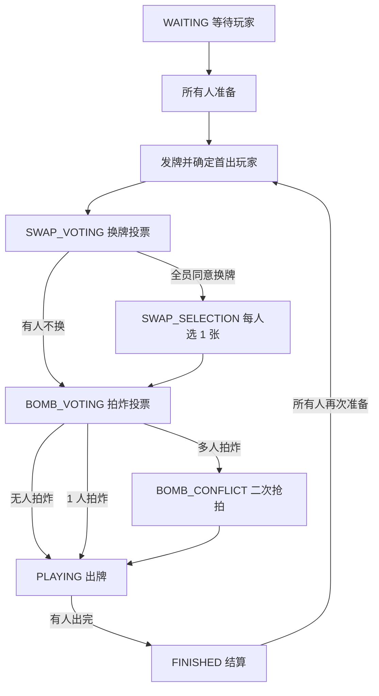

# 打朋友网页端纸牌规则与实现说明

本文档根据导出包 `C:/Users/admin/Downloads/project_20260426_112359.tar.gz` 中的源码整理，作为后续把 Figma 网页 UI、前端交互和后端规则整合时的规则依据。当前规则以导出项目源码为准，不额外套用外部地方玩法。

## 1. 项目来源与核心文件

导出项目是一个 Next.js App Router 项目，核心游戏逻辑集中在以下文件：

| 文件 | 作用 |
| --- | --- |
| `src/lib/game/types.ts` | 牌、玩家、房间、游戏状态、消息类型等 TypeScript 类型定义 |
| `src/lib/game/card.ts` | 创建牌堆、洗牌、排序、显示文本、顺子判断、查找方块 4 与最小牌 |
| `src/lib/game/rules.ts` | 牌型识别与跟牌合法性判断 |
| `src/lib/game/engine.ts` | 房间、准备、发牌、换牌、拍炸/抢拍、出牌、跳过、结算 |
| `src/app/api/*` | Next.js API 路由，封装游戏引擎方法 |
| `src/components/game/GameBoardNew.tsx` | 当前页面使用的新版游戏面板，采用换牌投票和拍炸投票流程 |

当前后端规则是内存单例 `GameEngine`，房间数据存放在 `Map<string, Room>` 中。服务重启后房间会丢失，后续如果需要生产可用，需要接入数据库或其他持久化状态层。

## 2. 基础牌规则

### 2.1 牌堆

- 使用一副 52 张扑克牌，去掉大小王。
- 花色有四种：方块、梅花、红桃、黑桃。
- 当前引擎发牌时每名玩家固定发 13 张。
- UI 文案标注支持 2-4 人，源码中游戏面板也按最多 4 个座位布局。后端当前没有严格限制最大人数，后续应补上 2-4 人校验。

### 2.2 大小顺序

牌点大小：

```text
4 < 5 < 6 < 7 < 8 < 9 < 10 < J < Q < K < A < 2 < 3
```

花色大小：

```text
方块 < 梅花 < 红桃 < 黑桃
```

默认手牌排序先按牌点，再按花色，从小到大排列。

### 2.3 顺子特殊顺序

顺子判断使用独立顺序：

```text
A, 2, 3, 4, 5, 6, 7, 8, 9, 10, J, Q, K
```

当前实现支持：

- `A2345`，作为最小顺子。
- `23456` 到 `910JQK` 的普通连续顺子。
- `10JQKA`，作为最大顺子。

## 3. 牌型识别

合法出牌张数只有 1、2、3、5 张。

| 张数 | 牌型 | 识别规则 |
| --- | --- | --- |
| 1 | 单牌 | 任意 1 张 |
| 2 | 对子 | 2 张牌点相同 |
| 3 | 三张 | 3 张牌点相同，仅在特定场景可出 |
| 5 | 顺子 | 5 张连续牌 |
| 5 | 同花 | 5 张同花色，不要求连续 |
| 5 | 三带二 | 3 张同点数 + 1 个对子 |
| 5 | 四带一 | 4 张同点数 + 任意 1 张 |
| 5 | 同花顺 | 同花色且连续 |

五张牌型的压制关系：

```text
顺子 < 同花 < 三带二 < 四带一 < 同花顺
```

注意：这里的“四带一”是五张牌型中的一种；“拍炸/抢拍”是开局加倍机制，不是普通出牌牌型。

## 4. 跟牌规则

### 4.1 通用规则

- 如果上一手是单牌、对子、三张，则必须跟同类牌型。
- 如果上一手是五张牌型，可以用同类更大的牌跟，也可以用更高权重的五张牌型压制。
- 低权重五张牌型不能压制高权重五张牌型。
- 其他张数组合无效。

### 4.2 单牌

单牌跟牌规则：

- 同花色时，必须牌点更大。
- 不同花色时，必须牌点相同且花色更大，也就是“转花色”。
- 不能同时换花色又换牌点。

示例：

- 梅花 5 可以压梅花 4。
- 红桃 5 可以压梅花 5。
- 梅花 6 不能压红桃 5。

### 4.3 对子

对子跟牌规则：

- 牌点相同时，比对子中的最大花色。
- 牌点更大时，必须至少包含上一手对子中的一种花色。

示例：

- 红桃 5 + 黑桃 5 可以压梅花 5 + 方块 5。
- 红桃 6 + 梅花 6 可以压梅花 5 + 方块 5，因为包含梅花。
- 红桃 6 + 梅花 6 不能压方块 5 + 黑桃 5，因为没有包含方块或黑桃。

### 4.4 三张

三张只能在以下场景使用：

- 第一手牌。
- 跟上一手三张。
- 玩家手里只剩 3 张牌时，作为最后一手打出。

三张跟牌规则：

- 牌点相同时，比三张中的最大花色。
- 牌点更大时，必须至少包含上一手三张中的一种花色。
- 非上述场景不能随意出三张。

### 4.5 顺子

顺子比较：

- 先比较顺子大小，`A2345` 最小，`10JQKA` 最大。
- 顺子大小相同时，比顺子最大牌的花色。

### 4.6 同花

同花比较：

- 先比花色，花色更大的同花更大。
- 花色相同时，比同花中最大牌的牌点。

### 4.7 三带二、四带一、同花顺

- 三带二：先比三张部分的牌点，牌点相同再比三张部分中的最大花色。
- 四带一：先比四张部分的牌点，牌点相同再比四张部分中的最大花色。
- 同花顺：先比顺子大小，大小相同再比花色。

## 5. 对局状态流

当前实现中的主要状态如下：

```text
WAITING -> SWAP_VOTING -> SWAP_SELECTION -> BOMB_VOTING -> BOMB_CONFLICT -> PLAYING -> FINISHED
```

实际会按玩家选择跳过部分状态：



## 6. 开局与首出

发牌后会确定首出玩家：

- 正常情况下，持有方块 4 的玩家先出。
- 如果没有方块 4，例如少于 4 人时方块 4 没发出去，则比较所有玩家手中最小单牌，最小牌持有者先出。
- 如果有人拍炸且只有一个最终拍炸/抢拍玩家，则拍炸/抢拍玩家优先出牌。
- 如果多人二次抢拍后仍有多人继续抢拍，则在继续抢拍者中比较最小单牌，最小牌持有者先出。

第一手限制：

- 正常方块 4 开局时，第一手必须包含方块 4。
- 如果是最小牌开局，第一手必须包含该玩家当前最小牌。
- 如果当前玩家是拍炸玩家，则不受方块 4 或最小牌限制。

## 7. 换牌流程

当前推荐使用新版投票流程，也就是 `GameBoardNew.tsx` 使用的接口：

1. 每名玩家在 `SWAP_VOTING` 阶段选择是否换牌。
2. 每名玩家确认投票。
3. 如果有任意玩家选择不换，立即进入 `BOMB_VOTING`。
4. 如果所有玩家都同意换牌，进入 `SWAP_SELECTION`。
5. 每名玩家选择 1 张手牌并确认。
6. 所有人确认后，引擎收集这些牌，洗牌后按收集顺序重新分配给各玩家。
7. 换回来的牌会标记 `isSwapped = true`，前端可用来高亮。
8. 换牌完成后进入 `BOMB_VOTING`。

导出项目里还保留了旧版“申请换牌、同意、拒绝”的接口。后续整合时建议只保留一种流程，优先保留新版投票流程。

## 8. 拍炸与抢拍流程

“拍炸”是加倍机制。

### 8.1 拍炸投票

在 `BOMB_VOTING` 阶段：

- 每名玩家选择拍或不拍。
- 每名玩家确认投票。
- 全员确认后统计结果。

结果：

- 无人拍：所有玩家倍率 `1x`，进入出牌。
- 1 人拍：所有玩家倍率 `2x`，拍炸玩家先出。
- 多人拍：进入 `BOMB_CONFLICT` 二次抢拍阶段。

### 8.2 二次抢拍

在 `BOMB_CONFLICT` 阶段，只有已拍炸玩家需要选择是否继续抢拍：

- 所有人放弃抢拍：所有玩家倍率 `2x`，第一个拍炸玩家先出。
- 只有 1 人抢拍：抢拍玩家 `4x`，其他玩家 `2x`，抢拍玩家先出。
- 多人抢拍：抢拍玩家 `4x`，其他玩家 `2x`，抢拍者中最小单牌持有者先出。

## 9. 出牌与跳过

### 9.1 出牌

玩家只能在 `PLAYING` 阶段出牌，且必须轮到自己。

出牌过程：

1. 根据牌 ID 找到当前玩家手牌。
2. 校验牌型是否合法。
3. 校验三张特殊限制。
4. 如果本轮已有上一手，则调用跟牌规则判断能否压过上一手。
5. 如果本轮没有上一手，则应用第一手必须包含方块 4 或最小牌的规则。
6. 从玩家手牌中移除已出的牌，写入 `currentPlay` 和 `lastPlayedCards`。
7. 如果玩家手牌为空，进入结算。
8. 否则切换到下一名玩家。

### 9.2 跳过

跳过规则：

- 第一手不能跳过。
- 还没有任何上一手牌时不能跳过。
- 每次跳过会切到下一名玩家。
- 当除本轮出牌者外的其他玩家都跳过后，开启新一轮：
  - 当前玩家回到本轮最后有效出牌者。
  - `lastPlayedCards` 清空。
  - 跳过计数归零。
  - 三张回合标记清空。

## 10. 胜负与计分

当某名玩家手牌为 0 时，本局结束。

基础计分：

- 输家扣分 = 剩余手牌数 × 当前倍率。
- 如果输家一张牌都没出，也就是仍剩 13 张，则按 15 张计算。
- 正常情况下，只有出完牌的玩家是赢家，所有输家扣分总和加给该赢家。

拍炸相关计分：

- 如果拍炸/抢拍玩家赢了，所有输家都使用拍炸/抢拍玩家的倍率扣分。
- 如果拍炸/抢拍玩家输了，拍炸/抢拍玩家是唯一输家，其他所有玩家都是赢家。
- 拍炸玩家输了时，扣分 = 剩余牌数 × 拍炸倍率 × 赢家数量，然后平均分给所有赢家。

## 11. API 对照

### 11.1 房间

| 接口 | 用途 | 主要参数 |
| --- | --- | --- |
| `POST /api/room` | 创建房间 | `roomName`, `playerName` |
| `POST /api/room/[roomId]/join` | 加入房间 | `playerName`, `sessionId?` |
| `GET /api/room/[roomId]` | 获取房间状态 | URL 参数 `roomId` |

### 11.2 准备与出牌

| 接口 | 用途 | 主要参数 |
| --- | --- | --- |
| `POST /api/game` | 准备或取消准备；全员准备后自动开局 | `roomId`, `playerId`, `sessionId` |
| `POST /api/game/play` | 出牌 | `roomId`, `playerId`, `sessionId`, `cardIds` |
| `POST /api/game/skip` | 跳过 | `roomId`, `playerId`, `sessionId` |
| `POST /api/game/sort` | 保存手牌顺序 | `roomId`, `playerId`, `cardIds` |

### 11.3 新版换牌流程

| 接口 | 用途 | 主要参数 |
| --- | --- | --- |
| `POST /api/game/swap/vote` | 投票是否换牌 | `roomId`, `playerId`, `sessionId`, `wantsSwap` |
| `POST /api/game/swap/confirm-vote` | 确认换牌投票 | `roomId`, `playerId`, `sessionId` |
| `POST /api/game/swap/select` | 选择要换的 1 张牌 | `roomId`, `playerId`, `sessionId`, `cardId` |
| `POST /api/game/swap/confirm` | 确认换牌选择，所有人确认后执行换牌 | `roomId`, `playerId`, `sessionId` |

### 11.4 新版拍炸/抢拍流程

| 接口 | 用途 | 主要参数 |
| --- | --- | --- |
| `POST /api/game/bomb/vote` | 投票是否拍炸 | `roomId`, `playerId`, `sessionId`, `wantsBomb` |
| `POST /api/game/bomb/confirm-vote` | 确认拍炸投票 | `roomId`, `playerId`, `sessionId` |
| `POST /api/game/bomb/compete` | 二次抢拍选择 | `roomId`, `playerId`, `sessionId`, `wantsBomb` |
| `POST /api/game/bomb/confirm-compete` | 确认二次抢拍选择 | `roomId`, `playerId`, `sessionId` |

说明：`/api/game/bomb/compete` 的请求体字段名当前是 `wantsBomb`，路由内部会传给 `engine.competeBomb(..., wantsBomb)`，语义上实际表示“是否继续抢拍”。后续建议改名为 `wantsCompete`。

## 12. 后续整合建议与待确认点

后续接 Figma UI 前，建议先处理这些点：

- 后端补充人数限制：至少 2 人，最多 4 人，且开局前校验人数。
- `card.ts` 中 `dealCards()` 注释和实现是“每人 14 张”，但 `engine.ts` 实际发 13 张。当前 `dealCards()` 没被主流程使用，建议删除或改成 13 张，避免误用。
- `compareCards()` 先比花色再比牌点，但排序和最小牌判断是先比牌点再比花色。后续如果复用 `compareCards()` 要确认语义。
- `mustPlayCards()` 对五张牌型只是简化判断，不能直接作为“是否必须出牌”的完整依据。
- 多人拍炸后若只有某个玩家继续抢拍，结算逻辑当前用 `players.find(p => p.hasBomb === true)` 找拍炸玩家，可能拿到原始拍炸列表里的第一个玩家，而不是最终抢拍玩家。建议结算时改用最终 `bombSelection.players` 或明确的 `bombPlayerId`。
- 当前同时存在旧版换牌/拍炸接口和新版投票接口。Figma UI 整合时建议统一到新版流程，旧接口删除或标记废弃。
- 当前前端主要通过 2 秒轮询 `GET /api/room/[roomId]` 更新状态；项目里有 Socket.IO 路由雏形，但页面未真正使用。后续要在“轮询”和“实时推送”里选一个主方案。
- 当前房间状态只在内存中，刷新服务会丢数据。正式联机版本建议接入数据库或 Redis，并把规则引擎改成可序列化、可恢复的状态机。

## 13. Figma UI 对接时的页面状态映射

Figma 页面可以按以下状态拆组件：

| 游戏状态 | UI 需要展示 |
| --- | --- |
| `WAITING` | 创建/加入房间、玩家列表、准备按钮 |
| `SWAP_VOTING` | 每名玩家是否换牌的投票状态、当前玩家的换/不换按钮、确认按钮 |
| `SWAP_SELECTION` | 当前玩家手牌、选择 1 张换牌、其他玩家选择/确认进度 |
| `BOMB_VOTING` | 是否拍炸投票、确认进度、倍率提示 |
| `BOMB_CONFLICT` | 已拍炸玩家二次抢拍选择、抢拍确认进度、倍率预览 |
| `PLAYING` | 桌面上一手牌、当前出牌者、手牌、出牌/跳过按钮、剩余牌数、积分倍率 |
| `FINISHED` | 本局赢家、积分变化、排行榜、准备下一局按钮 |

核心原则：前端只负责展示状态和提交动作，出牌合法性、计分、换牌和拍炸结果必须以后端 `GameEngine` 为准。
