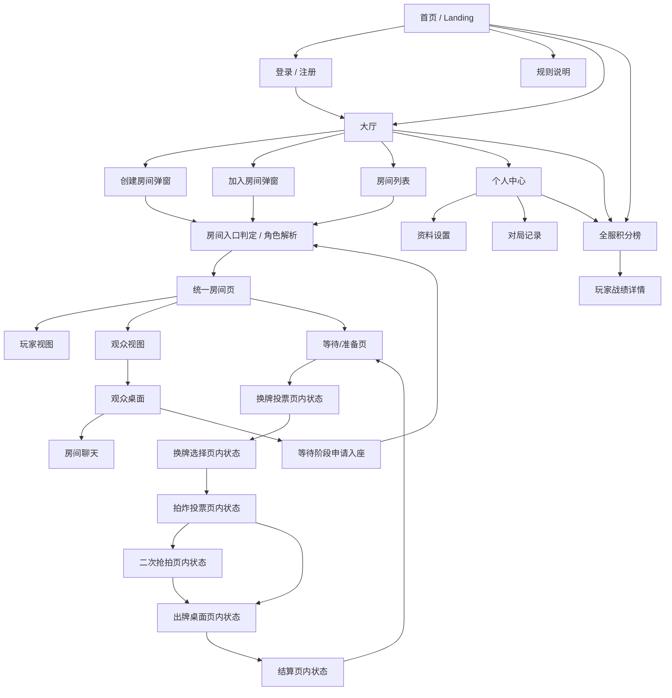

# 打朋友网页端需求文档

版本：v0.1  
日期：2026-04-26  
关联规则文档：`GAME_RULES_IMPLEMENTATION.md`

## 1. 核心定位

“打朋友网页端”是一款面向熟人局、轻竞技和围观互动场景的实时在线纸牌游戏平台。它的核心不是做复杂棋牌大厅，而是把已有“打朋友”规则稳定搬到网页端，让玩家可以快速登录、开房、邀请好友、进入对局，并让更多人以观众身份围观、聊天和参与氛围。

产品关键词：

- 实时联机：玩家出牌、换牌、拍炸、结算等状态需要实时同步。
- 熟人房间：以创建房间、输入房间号、链接邀请为主要进入方式。
- 围观互动：每桌玩家人数有限，但观战人数产品上不设硬上限。
- 轻量账号：注册登录用于身份、昵称、历史记录和聊天权限。
- 小规模并发：首版目标支持 30-40 名在线玩家同时游戏，可同时存在多桌房间；观众数量可扩展。

## 2. 用户角色

| 角色 | 说明 | 主要权限 |
| --- | --- | --- |
| 游客 | 未登录用户 | 查看首页、规则说明、公开房间列表、全服积分榜；可进入公开房间只读观战，不能发言、不能入座 |
| 登录用户 | 已注册并登录用户 | 创建房间、加入座位、观战、发言、查看个人记录和全服积分榜 |
| 房主 | 创建房间的登录用户 | 修改房间设置、邀请玩家、开始前踢出未准备玩家、关闭房间 |
| 玩家 | 房间座位上的用户 | 准备、换牌投票、拍炸投票、出牌、跳过、聊天 |
| 观众 | 房间内未入座用户 | 观看公开信息、查看上一手牌和比分、聊天；不能看玩家手牌，不能操作对局 |
| 管理员 | 后台管理角色 | 查看在线房间、处理异常房间、禁言或封禁用户 |

## 3. 核心功能列表

### 3.1 账号与身份

- 用户注册：用户名 + 密码为首版方案；后续可扩展手机号、邮箱或第三方登录。
- 用户登录/退出：登录后保留会话，刷新页面不丢身份。
- 昵称与头像：昵称用于房间、聊天和排行榜显示。
- 游客模式：游客可浏览和只读观战，但不能坐下游戏或发送聊天。
- 身份保护：所有游戏操作必须校验用户身份，避免冒名操作他人手牌。

### 3.2 大厅与房间

- 创建房间：登录用户可创建房间，生成房间号和邀请链接。
- 加入房间：支持输入房间号或打开邀请链接加入。
- 房间列表：展示公开房间、人数、状态、观战人数、是否可入座。
- 房间状态：等待中、换牌投票、拍炸投票、出牌中、已结束。
- 房间人数：每桌玩家建议 2-4 人；网站层面首版目标支持 30-40 名玩家同时在线游戏。
- 多桌并行：同一时间可存在多个房间，例如 8-10 桌 4 人局。

### 3.3 游戏对局

游戏规则以 `GAME_RULES_IMPLEMENTATION.md` 为准，前端只负责展示和提交操作，后端负责校验。

- 准备开局：所有入座玩家准备后发牌。
- 手牌展示：当前玩家可见自己的手牌；其他玩家只显示剩余张数。
- 换牌投票：全员选择是否换牌，有人不同意则跳过换牌。
- 换牌选择：全员同意后，每人选 1 张牌，系统洗牌后重新分配。
- 拍炸投票：所有玩家选择是否拍炸。
- 二次抢拍：多人拍炸时进入二次抢拍，决定 2 倍或 4 倍倍率。
- 出牌操作：选择手牌并出牌，由后端判断牌型和能否跟牌。
- 跳过操作：符合规则时可以跳过，所有其他玩家跳过后开启新一轮。
- 结算：有人出完牌后结算积分，展示赢家、输赢分和排行榜。
- 下一局：结束后所有玩家重新准备即可开始下一局。

### 3.4 观战功能

- 进入观战：用户可从大厅、房间链接或房间内“观战”入口进入。
- 观战人数：产品不设硬上限；技术实现可配置软上限和扩容策略。
- 观众视角：只能看到公共信息，包括桌面上一手牌、当前回合、玩家剩余牌数、积分、聊天和系统消息。
- 隐私限制：观众不能看到任何玩家手牌、换牌选择详情或未公开决策。
- 入座切换：等待阶段如果有空座，登录观众可申请入座；游戏开始后不能中途入座。
- 退出观战：观众离开不影响牌局。

### 3.5 聊天功能

- 房间聊天：玩家和登录观众可在房间内打字聊天。
- 系统消息：自动记录关键事件，例如玩家加入、准备、开始、拍炸、出牌、跳过、结算。
- 发言身份：聊天消息显示头像、昵称、角色标记。
- 游客限制：游客只读，不可发言。
- 基础治理：支持屏蔽用户、禁言、敏感词过滤和举报入口，首版可先做简单禁言。

### 3.6 个人中心

- 基础资料：头像、昵称、注册时间。
- 对局记录：最近对局、胜负、积分变化、所在房间。
- 简单统计：总局数、胜局、胜率、累计积分。
- 设置：修改昵称、密码、退出登录。

### 3.7 全服积分排行榜

- 开服总榜：按用户开服以来累计积分排序，展示“谁是全服最强”。
- 榜单入口：首页、大厅、个人中心和结算页都可进入。
- 榜单字段：排名、头像、昵称、累计积分、总局数、胜局、胜率、最近活跃时间。
- 我的排名：登录用户可看到自己的全服排名、距离上一名差多少积分。
- 玩家详情：点击榜单用户可查看公开战绩摘要。
- 更新时机：每局结算完成后写入积分变化，并刷新排行榜。
- 防刷规则：只统计正常完成的对局；异常关闭、未结算房间不计入榜单。

### 3.8 管理与运维

- 在线房间监控：查看房间号、玩家数、观众数、当前状态。
- 异常处理：关闭卡死房间、踢出异常连接。
- 用户管理：禁言、解禁、封禁。
- 日志：记录关键游戏事件和错误，便于排查争议。

## 4. 功能优先级

| 优先级 | 功能 |
| --- | --- |
| P0 首版必须 | 注册登录、创建/加入房间、房间入口判定、角色恢复、准备开局、完整游戏规则、换牌、拍炸/抢拍、出牌、结算、房间内轮询或实时同步 |
| P1 强建议 | 观战、房间聊天、邀请链接、房间列表、个人对局记录、全服积分排行榜 |
| P2 后续增强 | 大厅聊天、头像上传、管理员后台、举报禁言、赛季榜、断线重连优化 |

## 5. 页面结构图

## 6. 页面拆分说明

### 6.1 首页

目标：让新用户理解这是“打朋友”网页端，并快速进入登录、注册、规则或大厅。

主要内容：

- 产品名称和一句话介绍。
- 进入大厅按钮。
- 登录/注册入口。
- 规则说明入口。
- 全服积分榜入口，可展示榜单前三名作为吸引点。
- 当前在线人数和正在进行的房间数。

交互：

- 未登录点击进入大厅，可浏览公开房间；点击创建房间、入座或聊天时要求登录。
- 已登录用户进入大厅时直接显示昵称和个人入口。

### 6.2 登录/注册页

目标：建立稳定用户身份，支撑游戏操作、聊天和记录。

主要内容：

- 注册表单：用户名、密码、确认密码。
- 登录表单：用户名、密码。
- 登录状态保持。
- 错误提示：用户名已存在、密码错误、网络失败。

交互：

- 登录成功后回到之前想进入的页面，例如大厅、房间或观战页。
- 如果用户从邀请链接进入，登录后应继续进入该房间。

### 6.3 大厅页

目标：承接所有进入游戏前的操作。

主要内容：

- 创建房间。
- 输入房间号加入。
- 公开房间列表。
- 在线玩家数、观战人数、房间状态。
- 个人中心入口。
- 全服积分榜入口。

交互：

- 创建房间后进入房间入口判定，创建者成为房主并自动入座，再进入统一房间页的玩家视图。
- 点击加入房间时先进入房间入口判定：如果用户已是该房间玩家则恢复玩家视图；如果未入座且房间等待中、有空座，则进入座位选择；如果房间已开始或满员，则进入观众视图。
- 点击观战直接进入统一房间页的观众视图。

### 6.4 游戏房间页

目标：承载完整对局，是产品核心页面。房间页是统一页面，不再拆成“游戏房间页”和“观战房间页”两个独立页面；玩家和观众只是在同一房间页下看到不同视图。

房间页内部按状态展示不同控制区：

- 等待/准备：座位、玩家列表、准备按钮、邀请链接、观众列表。
- 换牌投票：换/不换选择、确认按钮、玩家投票进度。
- 换牌选择：手牌区、选择 1 张换牌、确认按钮、其他玩家确认进度。
- 拍炸投票：拍/不拍选择、确认按钮、倍率提示。
- 二次抢拍：继续抢拍或放弃、确认按钮、抢拍结果预览。
- 出牌桌面：当前回合、上一手牌、手牌、出牌按钮、跳过按钮、剩余牌数、积分。
- 结算：赢家、积分变化、排行榜、准备下一局。

交互：

- 所有操作按钮都依赖当前状态和当前用户身份。
- 非当前玩家不能出牌或跳过。
- 玩家刷新、断线重连或通过邀请链接重新进入时，如果仍在座位上，应恢复玩家视图和手牌。
- 观众在同一房间页使用观众视图，不显示手牌和操作按钮。
- 聊天区贯穿整个房间生命周期。

### 6.5 房间入口判定与角色解析

目标：解决“用户进房间后到底是玩家还是观众”的分流问题，避免页面跳转和权限混乱。

进入来源：

- 创建房间成功后。
- 大厅点击加入房间。
- 大厅点击观战。
- 输入房间号加入。
- 打开邀请链接。
- 登录后回跳到某个房间。
- 刷新页面或断线重连。

判定规则：

- 如果用户未登录，允许进入公开房间的游客观众视图；如果要入座或聊天，则跳转登录，登录后回到该房间。
- 如果用户已登录且已经是该房间玩家，直接恢复玩家视图。
- 如果用户已登录但不是玩家，房间处于等待阶段且有空座，展示“入座 / 观战”选择。
- 如果用户已登录但不是玩家，房间已开始或已满，进入观众视图。
- 如果房间是私密房间，只有邀请链接或房间号可进入；大厅列表不展示。
- 如果房间不存在或已关闭，展示错误页，并提供返回大厅入口。

### 6.6 观众视图

目标：让非玩家无压力围观，扩大互动氛围。

主要内容：

- 桌面公共牌区。
- 当前玩家提示。
- 玩家座位、剩余牌数、积分和倍率。
- 观众人数。
- 聊天区。
- 申请入座按钮，仅等待阶段且有空座时显示。

交互：

- 观众不能看到手牌。
- 观众不能触发任何游戏操作。
- 登录观众可聊天；游客只能观看。
- 游戏中途观众不能入座，只能下一局等待阶段申请入座。
- 观众申请入座后不直接进入游戏，需要重新经过房间入口判定，确认仍有空座且仍在等待阶段。

### 6.7 个人中心页

目标：沉淀用户身份和长期数据。

主要内容：

- 昵称、头像、账号信息。
- 最近对局记录。
- 胜率、总局数、累计积分。
- 当前全服排名和距离上一名的积分差。
- 修改资料、退出登录。

交互：

- 从大厅或房间可进入个人中心。
- 如果从房间进入，返回时应回到原房间。
- 点击个人排名可跳转到全服积分榜，并定位到自己所在名次。

### 6.8 全服积分榜页

目标：沉淀长期竞争目标，让玩家看到开服以来谁积分最高、谁最能打。

主要内容：

- 榜单标题，例如“开服总积分榜”。
- 前三名重点展示。
- 排名列表：名次、头像、昵称、累计积分、总局数、胜率。
- 我的排名卡片：当前排名、累计积分、距离上一名差距。
- 榜单说明：只统计正常完成并成功结算的对局。

交互：

- 游客可查看榜单，但点击个人详情时只展示公开摘要。
- 登录用户可查看自己的排名定位。
- 从结算页进入榜单时，可高亮本局参与玩家的排名变化。
- 点击玩家进入战绩详情页，展示公开战绩，不展示隐私信息。

### 6.9 管理后台

目标：首版可不做完整界面，但需要预留能力。

主要内容：

- 在线房间列表。
- 房间状态和人数。
- 用户列表。
- 禁言和关闭房间操作。

交互：

- 管理员操作需要二次确认。
- 关闭房间后，房间内用户收到系统提示并返回大厅。

## 7. 核心交互流程检查

检查结论：

- 合并页面：删除独立“观战房间页”的产品概念，改为“统一房间页 + 玩家视图 / 观众视图”。这样房间状态、聊天、观众人数、入座切换都只维护一套逻辑。
- 新增逻辑页：新增“房间入口判定 / 角色解析”。它不是强视觉页面，可以是路由守卫或加载态，但必须存在于产品逻辑中。
- 补充断线逻辑：玩家刷新、断线、重新打开邀请链接时，必须优先恢复原座位和玩家视图，不能直接变成观众。
- 补充入座逻辑：观众申请入座后必须重新判定空座和房间状态，避免多人同时抢同一个座位。
- 补充私密房逻辑：私密房不出现在公开大厅列表，但可通过房间号或邀请链接进入。

### 7.1 登录与进入房间

| 流程 | 是否通顺 | 检查结果 |
| --- | --- | --- |
| 游客打开首页 -> 浏览大厅 -> 点击创建房间 | 通顺 | 点击创建时弹出登录要求，登录后继续创建 |
| 用户通过邀请链接进入 -> 未登录 | 通顺 | 先登录，成功后回到对应房间 |
| 房间未满且未开始 -> 用户加入 | 需要补充 | 先进入房间入口判定，已登录用户可选择入座或观战 |
| 房间已满或已开始 -> 用户加入 | 通顺 | 自动进入观众视图 |
| 用户打开首页/大厅 -> 查看全服积分榜 | 通顺 | 榜单公开可看，登录后额外显示自己的排名 |
| 玩家刷新或断线重进房间 | 需要补充 | 根据登录态和座位关系恢复玩家视图，不应误判为观众 |
| 私密房间被大厅用户发现 | 不允许 | 私密房间不进公开列表，只能通过房间号或邀请链接进入 |

### 7.2 房间与对局

| 流程 | 是否通顺 | 检查结果 |
| --- | --- | --- |
| 创建房间 -> 等待好友 -> 全员准备 | 通顺 | 全员准备触发发牌和换牌投票 |
| 换牌投票 -> 有人不换 | 通顺 | 直接进入拍炸投票，避免卡住 |
| 换牌投票 -> 全员同意 | 通顺 | 进入每人选 1 张牌的换牌阶段 |
| 拍炸投票 -> 无人拍 | 通顺 | 直接开始普通倍率对局 |
| 拍炸投票 -> 1 人拍 | 通顺 | 该玩家先出，倍率为 2x |
| 拍炸投票 -> 多人拍 | 通顺 | 进入二次抢拍，解决首出和倍率 |
| 出牌 -> 其他玩家都跳过 | 通顺 | 回到最后有效出牌者开启新一轮 |
| 出完牌 -> 结算 -> 下一局 | 通顺 | 所有人重新准备后下一局开始 |
| 玩家游戏中离开页面 | 需要补充 | 短时间内标记离线并保留座位；超时后按房间规则处理，首版建议仅保留座位等待重连 |
| 房主等待阶段离开 | 需要补充 | 房主离开后自动转移房主给最早入座玩家；无玩家时关闭房间 |

### 7.3 观战与聊天

| 流程 | 是否通顺 | 检查结果 |
| --- | --- | --- |
| 用户从大厅点击观战 | 通顺 | 进入观众视角，不影响对局 |
| 观众在等待阶段申请入座 | 通顺 | 有空座且已登录时允许入座 |
| 观众在游戏中申请入座 | 不允许 | 只能等待下一局，防止影响牌局公平 |
| 登录观众聊天 | 通顺 | 可发言，但需显示观众身份 |
| 游客观战聊天 | 不允许 | 游客只读，降低治理成本 |
| 观众等待阶段申请入座 | 需要补充 | 申请后回到房间入口判定，避免座位已被别人抢占 |

### 7.4 排行榜

| 流程 | 是否通顺 | 检查结果 |
| --- | --- | --- |
| 对局结束 -> 结算积分 -> 更新全服榜 | 通顺 | 以服务端结算结果为唯一积分来源 |
| 玩家从结算页查看榜单 | 通顺 | 可看到本局后自己的排名变化 |
| 游客查看榜单 | 通顺 | 只展示公开数据，不暴露账号敏感信息 |
| 异常房间未结算 | 不计入 | 避免刷分或错误局影响全服排名 |

## 8. 数据与状态需求

### 8.1 用户数据

- `userId`
- `username`
- `nickname`
- `avatarUrl`
- `passwordHash`
- `createdAt`
- `lastLoginAt`
- `status`：正常、禁言、封禁

### 8.2 房间数据

- `roomId`
- `ownerId`
- `visibility`：公开、私密
- `inviteCode` 或 `inviteToken`：私密房和邀请链接使用
- `players`
- `spectators`
- `seats`：座位占用关系，记录每个座位对应的 `userId`
- `disconnectedPlayers`：短线离线但仍保留座位的玩家
- `gameState`
- `createdAt`
- `updatedAt`
- `currentRound`

### 8.3 聊天数据

- `messageId`
- `roomId`
- `userId`
- `role`：玩家、观众、系统
- `content`
- `createdAt`

### 8.4 对局记录

- `gameId`
- `roomId`
- `players`
- `winnerIds`
- `scoreChanges`
- `startedAt`
- `endedAt`

### 8.5 全服积分榜数据

- `userId`
- `nickname`
- `avatarUrl`
- `totalScore`：开服以来累计积分
- `gamesPlayed`
- `wins`
- `winRate`
- `bestSingleGameScore`
- `rank`
- `lastGameAt`
- `updatedAt`

## 9. 实时同步要求

首版推荐使用 WebSocket 或 Socket.IO 做房间内实时同步。轮询可以作为临时方案，但对聊天、观战人数和出牌反馈不够顺滑。

需要实时广播的事件：

- 玩家加入、离开、入座、退出座位、观众转玩家。
- 玩家断线、重连、座位保留状态变化。
- 玩家准备状态变化。
- 换牌投票和确认进度。
- 拍炸投票和二次抢拍进度。
- 出牌、跳过、新一轮开始。
- 游戏结束和积分变化。
- 全服积分榜变化，至少在结算后更新参与玩家排名。
- 聊天消息。
- 观众人数变化。

容量目标：

- 玩家并发：首版支持 30-40 名玩家在线游戏。
- 房间并发：按 4 人一桌，目标支持约 8-10 桌同时对局。
- 观众：产品层不设硬上限；技术层建议先配置单房间软上限，例如 100 人，后续根据服务器能力调整。

## 10. 非功能需求

- 公平性：所有规则校验必须在后端执行，前端不能决定出牌是否合法。
- 隐私：观众和其他玩家永远不能拿到当前玩家手牌数据。
- 断线重连：用户刷新或短暂断线后，凭登录态回到原房间和角色。
- 性能：玩家出牌后，房间内用户应在 1 秒内看到状态更新。
- 可恢复：正式版本需要持久化房间状态，避免服务重启导致牌局丢失。
- 安全：密码必须加密存储；接口必须校验登录态和房间角色。
- 可维护：游戏规则引擎和 UI 分离，方便后续换 Figma UI 不影响规则。
- 排行榜可信度：全服榜只能由服务端结算写入，不能由前端提交积分。

## 11. 待确认问题

- 每桌玩家人数是否最终固定为 4 人，还是保留 2-4 人都能开局。
- 观众是否允许游客进入，当前建议允许游客只读观战，不允许聊天。
- 房间是否需要私密模式，当前建议支持公开/私密两种。
- 是否需要房主踢人功能，当前建议等待阶段支持。
- 聊天是否需要大厅公共频道，当前建议首版只做房间聊天。
- 对局记录是否需要完整回放，当前建议首版只记录结果，不做牌局回放。
- 全服排行榜是否只按累计积分排序，还是增加胜率榜、周榜、月榜；当前建议首版只做开服累计总榜。

## 12. 首版交付范围建议

首版建议围绕“能稳定开局、能完整打完、能观战聊天”交付：

1. 注册登录。
2. 大厅、创建房间、加入房间。
3. 游戏房间完整状态流。
4. 观众视角。
5. 房间聊天和系统消息。
6. 结算与简单对局记录。
7. 全服累计积分排行榜。
8. 断线重连和基本错误提示。

不建议首版同时做赛季榜、周榜、月榜、完整后台、牌局回放和大规模观众扩容。它们可以放到第二阶段。
