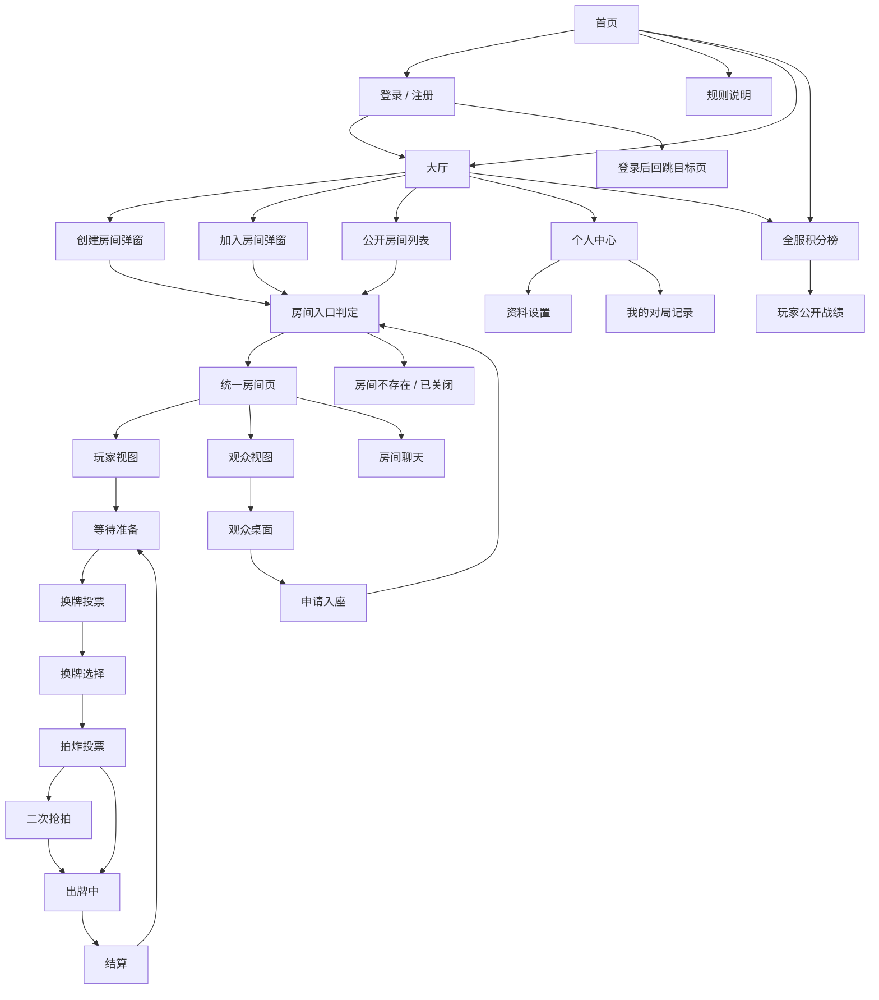

# 打朋友纸牌游戏网页版功能拆解与交互逻辑

用途：用于 Figma 绘制网页端前端界面。  
范围：覆盖首页、大厅、登录注册、统一房间页、观战、聊天、排行榜、个人中心和关键异常状态。  
规则依据：`GAME_RULES_IMPLEMENTATION.md`  
产品依据：`PRODUCT_REQUIREMENTS.md`

## 1. 产品前端定位

这是一个面向熟人局和围观互动的实时网页纸牌游戏平台。核心体验是：

- 玩家快速登录、开房、邀请好友、坐下打牌。
- 每桌玩家按“打朋友”规则对局，最多 2-4 名玩家入座。
- 网站整体可同时容纳 30-40 名玩家分布在多桌游戏中。
- 同一房间允许多人观战，观众不看手牌，只看公共桌面、比分、聊天和系统消息。
- 长期留存靠全服积分榜，展示开服以来累计积分最高的玩家。

Figma 设计重点：

- 页面第一优先级是“快速进入对局”。
- 房间页是最核心页面，需要覆盖多个游戏状态。
- 玩家视图和观众视图共用同一个房间页面，只是权限和可见区域不同。
- 聊天、观战人数、排行榜入口要自然嵌入，不要喧宾夺主。

## 2. 页面总结构



## 3. 全局组件

### 3.1 顶部导航栏

出现页面：`首页`、`大厅`、`规则说明`、`全服积分榜`、`个人中心`。

内容：

- 左侧：Logo / 产品名“打朋友”。
- 中间：大厅、规则、全服榜。
- 右侧未登录：登录、注册。
- 右侧已登录：头像、昵称、个人中心、退出。

交互：

- 点击 Logo 回首页。
- 点击大厅进入大厅页。
- 未登录点击创建房间、入座、聊天时弹登录弹窗或跳登录页。

### 3.2 登录要求弹窗

触发场景：

- 游客点击创建房间。
- 游客尝试入座。
- 游客尝试聊天。

内容：

- 标题：需要登录。
- 说明：登录后才能坐下游戏和发言。
- 按钮：去登录、继续观战、取消。

交互：

- 去登录：带上 `redirect`，登录后回到当前房间或大厅。
- 继续观战：关闭弹窗，保持游客观众视图。

### 3.3 消息提示 Toast

类型：

- 成功：创建房间成功、加入成功、发送成功。
- 警告：不是你的回合、还未轮到你、请先选择牌。
- 错误：房间不存在、身份失效、出牌不合法、网络断开。

### 3.4 加载/空态/错误态

加载态：

- 房间入口判定中。
- 房间状态同步中。
- 排行榜加载中。

空态：

- 大厅暂无公开房间。
- 排行榜暂无数据。
- 个人暂无对局记录。

错误态：

- 房间不存在。
- 房间已关闭。
- 网络断开。
- 登录态过期。

## 4. 页面 1：首页

目标：让用户快速理解产品，并进入大厅、登录或排行榜。

### 布局区域

1. 顶部导航栏。
2. 首屏主视觉区。
3. 快速操作区。
4. 全服榜前三预览。
5. 规则摘要区。

### 组件内容

主视觉区：

- 标题：打朋友。
- 副标题：开房即玩，好友围观，开服总榜见高低。
- 主按钮：进入大厅。
- 次按钮：创建房间。
- 次按钮：查看规则。

快速操作区：

- 创建房间卡片。
- 输入房间号卡片。
- 观战热门房间卡片。

全服榜前三预览：

- 第 1 名、第 2 名、第 3 名。
- 展示头像、昵称、累计积分。
- 按钮：查看完整榜单。

规则摘要：

- 2-4 人入座。
- 支持观战。
- 支持换牌、拍炸、抢拍。
- 积分结算进入全服榜。

### 交互

- 未登录点击创建房间：弹登录要求。
- 已登录点击创建房间：打开创建房间弹窗。
- 输入房间号：跳到加入房间弹窗或直接进入房间入口判定。
- 点击全服榜：进入全服积分榜页。

### Figma 需要画的状态

- 未登录首页。
- 已登录首页。
- 榜单暂无数据。
- 热门房间暂无数据。

## 5. 页面 2：登录 / 注册

目标：建立用户身份，支持回跳原目标页面。

### 布局区域

1. 品牌区。
2. 表单区。
3. 错误提示区。
4. 切换登录/注册入口。

### 登录表单

字段：

- 用户名。
- 密码。

按钮：

- 登录。
- 去注册。

状态：

- 默认。
- 输入中。
- 登录中。
- 用户名或密码错误。
- 登录态过期后重新登录。

### 注册表单

字段：

- 用户名。
- 昵称。
- 密码。
- 确认密码。

按钮：

- 注册并登录。
- 返回登录。

状态：

- 用户名已存在。
- 两次密码不一致。
- 密码太短。
- 注册成功。

### 交互

- 从邀请链接进入后未登录：登录成功后回到房间入口判定。
- 从创建房间触发登录：登录成功后继续创建房间。
- 从观众聊天触发登录：登录成功后回房间观众视图。

## 6. 页面 3：大厅

目标：创建房间、加入房间、发现公开房间、进入排行榜。

### 布局区域

1. 顶部导航栏。
2. 大厅状态栏。
3. 主要操作区。
4. 房间列表。
5. 右侧全服榜小组件。
6. 当前在线/观战统计。

### 大厅状态栏

展示：

- 当前在线玩家数。
- 正在进行的房间数。
- 当前观战人数。
- 当前用户昵称和积分。

### 主要操作区

按钮：

- 创建房间。
- 输入房间号加入。
- 快速观战。

创建房间弹窗字段：

- 房间名称。
- 房间类型：公开 / 私密。
- 玩家人数：2 人 / 3 人 / 4 人。
- 是否允许观战：允许 / 不允许。
- 是否允许游客观战：允许 / 不允许。

创建房间弹窗按钮：

- 创建。
- 取消。

加入房间弹窗字段：

- 房间号。

加入房间弹窗按钮：

- 加入房间。
- 仅观战。
- 取消。

### 房间列表

每个房间卡片展示：

- 房间名。
- 房间号。
- 房主昵称。
- 玩家数：例如 `3/4`。
- 观众数。
- 房间状态：等待中、游戏中、已结束。
- 是否公开。
- 操作按钮：加入、观战。

列表筛选：

- 全部。
- 可加入。
- 可观战。
- 游戏中。

### 交互

- 点击加入：进入房间入口判定。
- 点击观战：进入房间入口判定，并带上观战意图。
- 房间已开始时，加入按钮变为观战。
- 私密房不出现在公开列表。
- 未登录创建房间：弹登录要求。

### Figma 需要画的状态

- 有公开房间。
- 无公开房间。
- 房间列表加载中。
- 创建房间弹窗。
- 加入房间弹窗。
- 未登录触发登录要求弹窗。

## 7. 页面 4：房间入口判定 / 角色解析

目标：进入统一房间页前，判断用户身份和可用角色。

它可以设计成短暂加载页，也可以是统一房间页进入前的弹层。

### 判定状态

1. 房间加载中。
2. 房间不存在。
3. 房间已关闭。
4. 用户已是玩家：恢复玩家视图。
5. 用户不是玩家，房间等待中且有空座：展示入座/观战选择。
6. 用户不是玩家，房间游戏中或满员：进入观众视图。
7. 用户未登录：进入游客观众视图；尝试入座或聊天时要求登录。

### 入座选择弹层

内容：

- 房间名、房间号。
- 当前玩家数。
- 空座数量。
- 按钮：坐下游戏、先观战、返回大厅。

交互：

- 坐下游戏：占座成功后进入玩家视图等待准备。
- 坐下失败：提示座位已被占，刷新房间状态。
- 先观战：进入观众视图。

## 8. 页面 5：统一房间页基础布局

目标：承载玩家和观众共用的房间体验。

### 页面骨架

1. 房间顶部栏。
2. 桌面区域。
3. 玩家座位区。
4. 当前阶段操作区。
5. 手牌区，只有玩家视图显示。
6. 聊天区。
7. 观众区。
8. 房间系统消息。

### 房间顶部栏

内容：

- 房间名。
- 房间号。
- 复制邀请链接。
- 房间状态。
- 当前倍率。
- 玩家数。
- 观众数。
- 返回大厅。

房主额外操作：

- 房间设置。
- 等待阶段踢出玩家。
- 关闭房间。

### 玩家座位区

每个座位展示：

- 头像。
- 昵称。
- 当前积分。
- 本局倍率。
- 剩余牌数。
- 准备状态。
- 当前回合高亮。
- 离线标记。
- 房主标记。

座位空态：

- 空座。
- 按钮：坐下，观众且等待阶段可见。

### 桌面区域

展示：

- 上一手出牌玩家。
- 上一手牌。
- 当前轮到谁。
- 本轮已跳过玩家。
- 系统阶段提示。

### 聊天区

展示：

- 房间聊天。
- 系统消息。
- 输入框。
- 发送按钮。
- 禁言提示。

观众：

- 登录观众可发言。
- 游客仅可看，不显示输入框或显示登录后发言。

## 9. 房间页状态 A：等待 / 准备

### 玩家视图

显示：

- 座位列表。
- 当前玩家是否已准备。
- 准备按钮。
- 取消准备按钮。
- 邀请好友按钮。
- 房主设置入口。
- 观众列表。

按钮状态：

- 玩家未准备：显示准备。
- 玩家已准备：显示取消准备。
- 人数不足：准备按钮可点，但显示“至少 2 人开局”提示，或房主无法开始。
- 所有人准备后：自动进入发牌和换牌投票。

### 观众视图

显示：

- 座位列表。
- 观众列表。
- 申请入座按钮，只有有空座时显示。
- 聊天区。

交互：

- 观众申请入座：回到房间入口判定。
- 游客申请入座：弹登录要求。

### Figma 状态

- 等待中，没人准备。
- 部分玩家准备。
- 全员准备，进入下一阶段加载。
- 观众视图有空座。
- 观众视图无空座。

## 10. 房间页状态 B：换牌投票

### 玩家视图

显示：

- 手牌区。
- 投票面板：是否换牌。
- 选项按钮：换牌、不换。
- 确认按钮。
- 玩家投票进度。

投票进度：

- 未选择。
- 已选择未确认。
- 已确认。

按钮状态：

- 未选择时确认按钮禁用。
- 已确认后两个选项和确认按钮禁用。
- 有人选择不换并确认后，系统进入拍炸投票。

### 观众视图

显示：

- 当前阶段：换牌投票中。
- 每个玩家确认进度。
- 不显示具体选择，避免暴露策略。

### Figma 状态

- 当前玩家未选择。
- 当前玩家选择换牌但未确认。
- 当前玩家已确认。
- 观众视图只看进度。

## 11. 房间页状态 C：换牌选择

触发条件：所有玩家都同意换牌。

### 玩家视图

显示：

- 手牌区。
- 提示：请选择 1 张要交换的牌。
- 当前已选牌高亮。
- 确认换牌按钮。
- 取消选择按钮。
- 其他玩家确认进度。

按钮状态：

- 未选牌：确认按钮禁用。
- 已选牌：确认按钮可用。
- 已确认：手牌不可再改，等待其他玩家。

换回来的牌：

- 完成后，换回来的牌在手牌中有短暂高亮或角标。

### 观众视图

显示：

- 当前阶段：换牌选择中。
- 玩家确认进度。
- 不显示任何玩家选择了哪张牌。

### Figma 状态

- 未选牌。
- 已选牌。
- 已确认等待。
- 换牌完成，高亮换回来的牌。

## 12. 房间页状态 D：拍炸投票

### 玩家视图

显示：

- 阶段标题：是否拍炸。
- 当前倍率说明。
- 按钮：拍炸、不拍。
- 确认按钮。
- 玩家确认进度。

按钮状态：

- 未选择：确认禁用。
- 已选择未确认：确认可用。
- 已确认：不可修改。

结果：

- 无人拍炸：进入出牌，倍率 1x。
- 1 人拍炸：进入出牌，倍率 2x，拍炸玩家先出。
- 多人拍炸：进入二次抢拍。

### 观众视图

显示：

- 拍炸投票阶段。
- 玩家确认进度。
- 投票结束后可显示谁拍炸。

### Figma 状态

- 未选择。
- 选择拍炸。
- 选择不拍。
- 已确认等待。
- 投票结果：无人拍 / 1 人拍 / 多人拍。

## 13. 房间页状态 E：二次抢拍

触发条件：多人拍炸。

### 玩家视图

只有已拍炸玩家可操作。

显示：

- 标题：多人拍炸，是否继续抢拍。
- 倍率说明：继续抢拍为 4x，放弃保持 2x。
- 按钮：继续抢拍、放弃抢拍。
- 确认按钮。
- 已拍炸玩家确认进度。

未拍炸玩家：

- 只显示等待提示。
- 显示当前自己倍率预计为 2x。

结果：

- 全部放弃：所有玩家 2x，第一个拍炸玩家先出。
- 1 人继续：该玩家 4x，其他玩家 2x，该玩家先出。
- 多人继续：继续者 4x，其他玩家 2x，继续者中最小单牌玩家先出。

### 观众视图

显示：

- 二次抢拍中。
- 哪些玩家参与抢拍。
- 结果公布后显示最终倍率。

### Figma 状态

- 当前玩家是拍炸者，未选择。
- 当前玩家已选择继续。
- 当前玩家已选择放弃。
- 当前玩家不是拍炸者，等待。
- 抢拍结果公布。

## 14. 房间页状态 F：出牌中

### 玩家视图

显示：

- 桌面上一手牌。
- 当前轮到谁。
- 自己手牌。
- 已选手牌高亮。
- 出牌按钮。
- 跳过按钮。
- 一键整理 / 保存手牌顺序。
- 当前合法性提示。

按钮状态：

- 不是自己回合：出牌和跳过禁用。
- 自己回合，未选牌：出牌禁用。
- 自己回合，无上一手：跳过禁用。
- 自己回合，有上一手：跳过可用。
- 选牌不合法：出牌可点后提示错误，或前端预提示“牌型不合法”，最终以后端为准。

手牌交互：

- 点击牌选中 / 取消。
- 可多选。
- 出牌成功后选中清空。
- 出牌失败后保留选中并显示错误原因。

桌面提示：

- 第一手必须包含方块 4，或最小牌开局时必须包含最小牌。
- 拍炸玩家先出时显示拍炸标记。
- 本轮所有其他玩家跳过后，提示“新一轮开始”。

### 观众视图

显示：

- 桌面上一手牌。
- 当前轮到谁。
- 各玩家剩余牌数。
- 积分和倍率。
- 聊天区。

不显示：

- 玩家手牌。
- 出牌按钮。
- 跳过按钮。

### Figma 状态

- 自己回合，无上一手。
- 自己回合，需要跟牌。
- 不是自己回合。
- 出牌错误提示。
- 跳过后等待。
- 新一轮开始。
- 观众视图。

## 15. 房间页状态 G：结算

### 玩家视图

显示：

- 本局赢家。
- 每名玩家本局积分变化。
- 每名玩家剩余牌数。
- 拍炸/抢拍倍率说明。
- 当前全服积分变化。
- 准备下一局按钮。
- 查看全服榜按钮。
- 返回大厅按钮。

排行榜提示：

- 如果当前玩家排名上升，显示“排名上升 x 名”。
- 如果没有排名，显示“完成更多对局进入榜单”。

### 观众视图

显示：

- 本局赢家。
- 积分变化。
- 查看全服榜。
- 继续观战下一局。
- 如果等待阶段有空座，显示申请入座。

### Figma 状态

- 普通结算。
- 拍炸玩家赢。
- 拍炸玩家输。
- 当前玩家排名上升。
- 当前玩家准备下一局。
- 观众结算视图。

## 16. 页面 6：房间聊天

聊天可以作为房间页右侧固定面板，也可以在小屏做抽屉。

### 内容

- 聊天消息列表。
- 系统消息列表，和聊天消息可混排。
- 输入框。
- 发送按钮。
- 表情入口，后续可选。
- 在线观众数。

### 消息样式

玩家消息：

- 头像。
- 昵称。
- 玩家标签。
- 消息内容。
- 时间。

观众消息：

- 头像。
- 昵称。
- 观众标签。
- 消息内容。

系统消息：

- 灰色或弱强调。
- 示例：`阿强拍炸，本局积分翻倍`。

### 交互

- Enter 发送。
- 空消息不能发送。
- 游客输入框显示“登录后发言”。
- 被禁言用户显示禁言原因和剩余时间。

## 17. 页面 7：全服积分榜

目标：展示开服以来谁累计积分最高。

### 布局区域

1. 顶部导航栏。
2. 榜单标题区。
3. 前三名展示区。
4. 我的排名卡片。
5. 榜单表格。
6. 榜单规则说明。

### 榜单标题区

内容：

- 标题：全服积分榜。
- 副标题：开服以来累计积分排名。
- 更新时间。

### 前三名展示区

每个卡片：

- 名次。
- 头像。
- 昵称。
- 累计积分。
- 胜率。
- 总局数。

### 我的排名卡片

已登录：

- 我的名次。
- 我的累计积分。
- 距离上一名差多少分。
- 最近一局积分变化。

未登录：

- 文案：登录后查看你的排名。
- 登录按钮。

### 榜单表格字段

- 排名。
- 玩家。
- 累计积分。
- 总局数。
- 胜局。
- 胜率。
- 最近活跃。

### 交互

- 点击玩家：进入玩家公开战绩页。
- 从结算页进入：高亮本局参与玩家。
- 榜单为空：显示暂无排名，提示完成对局后上榜。

## 18. 页面 8：玩家公开战绩页

目标：从排行榜查看某个玩家的公开战绩。

### 内容

- 头像、昵称。
- 当前全服排名。
- 累计积分。
- 总局数。
- 胜局。
- 胜率。
- 最近 10 局公开记录。

### 限制

- 不展示账号用户名、登录时间、隐私信息。
- 不展示完整手牌回放。

## 19. 页面 9：个人中心

目标：查看自己的账号、战绩和设置。

### 布局区域

1. 个人资料卡。
2. 我的统计。
3. 我的全服排名。
4. 最近对局记录。
5. 设置区。

### 个人资料卡

- 头像。
- 昵称。
- 用户名。
- 注册时间。
- 修改昵称按钮。

### 我的统计

- 累计积分。
- 总局数。
- 胜局。
- 胜率。
- 最佳单局得分。

### 最近对局记录

字段：

- 时间。
- 房间号。
- 结果：胜 / 负。
- 积分变化。
- 对局人数。

### 设置区

- 修改昵称。
- 修改密码。
- 退出登录。

## 20. 页面 10：规则说明

目标：解释游戏规则，降低新玩家门槛。

### 内容结构

- 基础牌序。
- 花色大小。
- 支持牌型。
- 跟牌规则。
- 换牌规则。
- 拍炸/抢拍规则。
- 计分规则。
- 观战说明。

### 交互

- 从规则页可返回大厅。
- 可在房间内打开规则弹窗，默认定位到当前阶段相关规则。

## 21. 异常页面和弹窗

### 房间不存在 / 已关闭

内容：

- 标题：房间不存在或已关闭。
- 说明：可能房间号错误，或房主已关闭房间。
- 按钮：返回大厅、重新输入房间号。

### 网络断开

内容：

- 顶部或底部提示条：网络断开，正在重连。
- 重连成功后提示：已恢复连接。

### 身份失效

内容：

- 标题：登录已过期。
- 说明：请重新登录后继续。
- 按钮：去登录。

### 被踢出房间

内容：

- 标题：你已离开房间。
- 说明：房主移除了你，或房间已关闭。
- 按钮：返回大厅。

## 22. 关键交互闭环

### 22.1 创建房间闭环

1. 用户在大厅点击创建房间。
2. 未登录则先登录。
3. 填写房间设置。
4. 创建成功。
5. 进入房间入口判定。
6. 成为房主并自动入座。
7. 进入统一房间页等待准备。

### 22.2 加入房间闭环

1. 用户输入房间号或点击房间列表。
2. 进入房间入口判定。
3. 如果已是玩家，恢复玩家视图。
4. 如果等待中且有空座，选择坐下或观战。
5. 如果已开始或满员，进入观众视图。

### 22.3 观战转入座闭环

1. 观众在等待阶段点击申请入座。
2. 未登录则先登录。
3. 回到房间入口判定。
4. 系统重新确认空座。
5. 成功后进入玩家视图。
6. 失败则留在观众视图并提示座位已满。

### 22.4 游戏状态闭环

```text
等待准备 -> 换牌投票 -> 换牌选择或跳过换牌 -> 拍炸投票 -> 二次抢拍或直接出牌 -> 出牌中 -> 结算 -> 等待下一局
```

### 22.5 结算到排行榜闭环

1. 玩家出完牌。
2. 后端结算本局积分。
3. 写入对局记录。
4. 更新用户累计积分。
5. 刷新全服积分榜。
6. 结算页展示本局排名变化。
7. 用户可点击查看完整榜单。

### 22.6 断线重连闭环

1. 玩家刷新或网络断开。
2. 房间保留座位。
3. 用户重新进入房间链接。
4. 房间入口判定发现用户仍是玩家。
5. 恢复玩家视图和手牌。
6. 如果超时策略启用，显示离线或托管状态；首版建议只做保留座位等待重连。

## 23. Figma 页面清单

建议创建以下 Frame：

1. 首页 - 未登录。
2. 首页 - 已登录。
3. 登录页。
4. 注册页。
5. 大厅 - 有房间。
6. 大厅 - 无房间。
7. 创建房间弹窗。
8. 加入房间弹窗。
9. 登录要求弹窗。
10. 房间入口判定 - 加载。
11. 房间入口判定 - 入座/观战选择。
12. 房间错误 - 不存在或关闭。
13. 房间页 - 等待准备 - 玩家视图。
14. 房间页 - 等待准备 - 观众视图。
15. 房间页 - 换牌投票 - 玩家视图。
16. 房间页 - 换牌投票 - 观众视图。
17. 房间页 - 换牌选择 - 玩家视图。
18. 房间页 - 拍炸投票 - 玩家视图。
19. 房间页 - 二次抢拍 - 拍炸玩家视图。
20. 房间页 - 二次抢拍 - 非拍炸玩家视图。
21. 房间页 - 出牌中 - 自己回合。
22. 房间页 - 出牌中 - 非自己回合。
23. 房间页 - 出牌中 - 观众视图。
24. 房间页 - 结算 - 玩家视图。
25. 房间页 - 结算 - 观众视图。
26. 房间聊天面板。
27. 全服积分榜。
28. 玩家公开战绩页。
29. 个人中心。
30. 规则说明页。
31. 网络断开提示。
32. 身份失效弹窗。

## 24. 首版设计边界

首版必须画：

- 首页。
- 登录/注册。
- 大厅。
- 创建/加入房间弹窗。
- 房间入口判定。
- 统一房间页所有游戏状态。
- 聊天面板。
- 全服积分榜。
- 个人中心基础页。
- 规则说明页。
- 关键错误态。

首版可不画或简单画：

- 管理后台。
- 复杂赛季榜。
- 牌局回放。
- 大厅公共聊天。
- 头像上传裁剪。

## 25. 设计注意事项

- 不要把观众页设计成独立产品路径，应表现为同一个房间里的观众视图。
- 房间页要优先保证玩家手牌、当前回合、操作按钮清晰。
- 聊天不要遮挡手牌和出牌按钮。
- 排行榜入口要明显，但不能干扰对局操作。
- 所有玩家操作按钮必须有禁用态、加载态、成功态、失败态。
- 观众不能看到手牌，设计稿中必须明确隐藏区域。
- 移动端如果后续要做，应把聊天改为抽屉，手牌放底部，桌面放中间。
